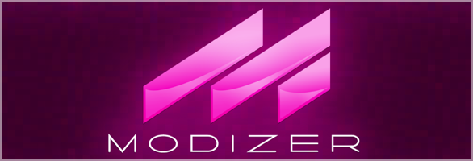

\
Modizer
=======

iOS modules, chip tunes, midi & vgm player with integration of various online DB (Modland, HVSC, ASMA, vgmrips, snesmusicv2, zxart, ...).

Support iOS 13+

Modizer's logo by Steve Miele.

## Building

Requires Xcode, currently building with XCode 16.4 in arm64 environment.\
Simulator for Intel based Mac might not work, I cannot test anymore.\

Open Modizer Xcode project file to build, should be quite straightforward.

## Main libraries used
Modizer is using several playback libraries to support a wide range of music format from old computers & consoles.
|  |  |
| ------------ | ------------ |
| - [Adplug](https://github.com/adplug/adplug) | - [Another Slight Atari Player(ASAP)](https://asap.sourceforge.net/) |
| - [AtariAudio](https://github.com/arnaud-carre/sndh-player) | - [Eupmini](https://github.com/gzaffin/eupmini) |
| - [ffmpeg/mpg123/vorbis](https://github.com/arthenica/ffmpeg-kit) | - [Game Music Emu](https://github.com/libgme/game-music-emu) | 
| - [FMPmini](https://github.com/myon98/98fmplayer) | - [HighlyExperimental](https://gitlab.com/kode54/highly_experimental/) |
| - [HighlyQuixotic](https://gitlab.com/kode54/highly_quixotic/) | - [HighlyTheoritical](https://gitlab.com/kode54/highly_theoretical/) |
| - [AHX/Hively tracker](https://github.com/pete-gordon/hivelytracker) | - [LazyUSF](https://github.com/derselbst/lazyusf) |
| - [Libvgm](https://github.com/ValleyBell/libvgm) | - [mdxmini](https://github.com/gzaffin/mdxmini) |
| - [NSFPlay](https://bbbradsmith.github.io/nsfplay/) | - [libopenmpt](https://lib.openmpt.org/libopenmpt/) |
| - [PlayGSF](https://github.com/yshui/playgsf) | - [Pmdmini](https://github.com/mistydemeo/pmdmini) |
| - [PxTone / Organya](https://www.wothke.ch/webPixel/) | - [PT3Player](https://github.com/Volutar/pt3player) |
| - [SC68](https://github.com/Zeinok/sc68) | - [Sibplayfp](https://github.com/libsidplayfp/sidplayfp) |
| - [Snes9x/snsf](https://github.com/loveemu/snsf9x) | - [ST-Sound](http://leonard.oxg.free.fr/stsound_download.html) |
| - [Timidity++](https://timidity.sourceforge.net/) | - [UADE](https://zakalwe.fi/uade/) |
| - [XSF (2SF, NCSF)](https://github.com/CyberBotX/in_xsf) | - [libXMP](https://github.com/libxmp/libxmp) |
| - [V2M tinyplayer](https://github.com/jgilje/v2m-player) | - [VGMStream](https://github.com/vgmstream/vgmstream) |
| - [VIO2SF](https://bitbucket.org/kode54/vio2sf/src/master/) | - [WebSID](https://www.wothke.ch/websid/) |
| - [WebNEZ](https://bitbucket.org/wothke/webnez/src/master/) | - [ZXTune](https://bitbucket.org/zxtune/zxtune/src/develop/) |

Other main libs & frameworks:
 - [ASIHTTPRequest](https://allseeing-i.com/ASIHTTPRequest/)
 - [BButton](https://github.com/mattlawer/BButton)
 - [CBAutoScrollLabel](https://github.com/cbess/AutoScrollLabel)
 - [CMPopTipView](https://github.com/chrismiles/CMPopTipView)
 - [Dear ImGui](https://github.com/ocornut/imgui): bloat-free graphical user interface library for C++, with a custom iOS basic platform backend added for Modizer.
 - [GDataXML-HTML](https://github.com/graetzer/GDataXML-HTML)
 - [libarchive](https://github.com/libarchive/libarchive)
 - [Libsamplerate](https://github.com/libsndfile/libsamplerate)
 - [MetalANGLE](https://github.com/kakashidinho/metalangle): to have a translation layer between GLES 3.0 and Metal.
 - [MSColorPicker](https://github.com/sgl0v/MSColorPicker)
 - [NVDSP](https://github.com/bartolsthoorn/NVDSP)
 - [ProjectM](https://github.com/projectM-visualizer/projectm): the most advanced open-source music visualizer.
 - [SARUnArchiveANY](https://github.com/saru2020/SARUnArchiveANY)
 - [UnrarKIT](https://github.com/abbeycode/UnrarKit) 

## Star History

<a href="https://www.star-history.com/?repos=yoyofr%2Fmodizer&type=date&legend=top-left">
 <picture>
   <source media="(prefers-color-scheme: dark)" srcset="https://api.star-history.com/chart?repos=yoyofr/modizer&type=date&theme=dark&legend=top-left" />
   <source media="(prefers-color-scheme: light)" srcset="https://api.star-history.com/chart?repos=yoyofr/modizer&type=date&legend=top-left" />
   
 </picture>
</a>

## Statistics

<!-- LANGUAGES BREAKDOWN START -->
```
[ LANGUAGES BREAKDOWN ]

C            --> 3,303,266 lines
C++          --> 2,111,144 lines
Objective-C++ --> 93,967 lines
Objective-C  --> 51,907 lines
GLSL         --> 1,050 lines
Others       --> 4,077,840 lines

[ TOTAL LINES OF CODE: 9,639,174 ]
```
<!-- LANGUAGES BREAKDOWN END -->
